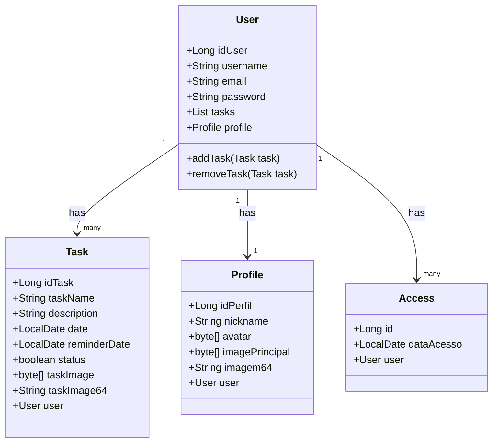

# Diagrama de Classes

### Explicação do Diagrama:

- **User**: Representa a entidade do usuário, contendo atributos como `idUser`, `username`, `email`,
- `password`, uma lista de `Task`, e um `Profile`.
- **Task**: Representa as tarefas atribuídas ao usuário, com atributos como `idTask`, `taskName`, `description`,
-  `date`, `reminderDate`, `status`, `taskImage`, e `taskImage64`.
- **Profile**: Representa o perfil do usuário, contendo atributos como `idPerfil`, `nickname`, `avatar`,
- `imagePrincipal`, e `imagem64`.
- **Access**: Representa os acessos feitos pelo usuário, com atributos como `id` e `dataAcesso`.

### Relações:

- Um `User` pode ter muitas `Task` (relação um-para-muitos).
- Um `User` tem um único `Profile` (relação um-para-um).
- Um `User` pode ter muitos `Access` (relação um-para-muitos).

### Como Usar:

1. **Ambiente de Suporte**: Para visualizar esse diagrama, você precisa de um ambiente que suporte o Mermaid,
2. como alguns editores Markdown, plataformas de documentação (ex: GitHub, GitLab) ou ferramentas de geração de
3. diagramas que suportam Mermaid.
4. **Inserir o Diagrama**: Cole o código acima em seu documento Markdown, utilizando a sintaxe apropriada para o
Mermaid, e visualize o diagrama.

