```mermaid
classDiagram
    class User {
        +Long idUser
        +String username
        +String email
        +String password
        +List<Task> tasks
        +Profile profile
        +addTask(Task task)
        +removeTask(Task task)
    }

    class Task {
        +Long idTask
        +String taskName
        +String description
        +LocalDate date
        +LocalDate reminderDate
        +boolean status
        +byte[] taskImage
        +String taskImage64
        +User user
    }

    class Profile {
        +Long idPerfil
        +String nickname
        +byte[] avatar
        +byte[] imagePrincipal
        +String imagem64
        +User user
    }

    class Access {
        +Long id
        +LocalDate dataAcesso
        +User user
    }

    class UserController {
        +UserService userService
        +PasswordEncoder passwordEncoder
        +getCadastre(Model model)
        +registerUser(User user)
        +getLogin(Model model)
        +loginUser()
    }

    class TaskController {
        +TaskService taskService
        +UserService userService
        +getHomeTask(Model model)
        +getCreateTask(Model model)
        +createTask(Task task)
        +detailTask(Long id, Model model)
        +editTask(Long id, Model model)
        +deleteTask(Long id)
    }

    class ProfileController {
        +ProfileService profileService
        +UserRepository userRepository
        +AccessRepository accessRepository
        +getProfile(Model model)
    }

    class UserRepository {
        +findByUsername(String username)
    }

    class TaskRepository {
        +findById(Long id)
    }

    class ProfileRepository {
        +findAll()
        +save(Profile profile)
        +deleteById(Long id)
    }

    class AccessRepository {
        +findByUser(User user)
    }

    class UserService {
        +listAllUsers()
        +saveUser(User user)
        +deleteUser(Long id)
        +getLoggedInUser() 
    }

    class TaskService {
        +listAllTask()
        +saveTask(Task task)
        +deleteTask(Long id)
        +searchTaskId(Long id)
    }

    class ProfileService {
        +listAllProfile()
        +saveProfile(Profile profile)
        +deleteProfile(Long id)
        +findProfileById(Long id)
    }

    User "1" --> "many" Task : has
    User "1" --> "1" Profile : has
    User "1" --> "many" Access : has
    UserController --> UserService : manages
    TaskController --> TaskService : manages
    ProfileController --> ProfileService : manages
    UserController --> UserRepository : interacts
    TaskController --> TaskRepository : interacts
    ProfileController --> UserRepository : interacts
    ProfileController --> AccessRepository : interacts
```

### Explicação do Diagrama:

- **Classes de Modelo**: `User`, `Task`, `Profile`, e `Access` representam a estrutura básica de dados.
- **Controladores**: `UserController`, `TaskController`, e `ProfileController` gerenciam a lógica da aplicação para as respectivas entidades.
- **Repositórios**: `UserRepository`, `TaskRepository`, `ProfileRepository`, e `AccessRepository` são interfaces que definem as operações de acesso a dados.
- **Serviços**: `UserService`, `TaskService`, e `ProfileService` encapsulam a lógica de negócios e interagem com os repositórios.
  
### Relações:

- Um `User` pode ter muitas `Task`, um único `Profile`, e muitos `Access`.
- Os controladores gerenciam suas respectivas entidades e interagem com os serviços e repositórios correspondentes.

### Como Usar:

1. **Ambiente de Suporte**: Para visualizar o diagrama, você pode usar um ambiente que suporte Mermaid, como um editor Markdown compatível ou plataformas como GitHub e GitLab.
2. **Inserir o Diagrama**: Cole o código acima em seu documento Markdown para visualizar o diagrama.

